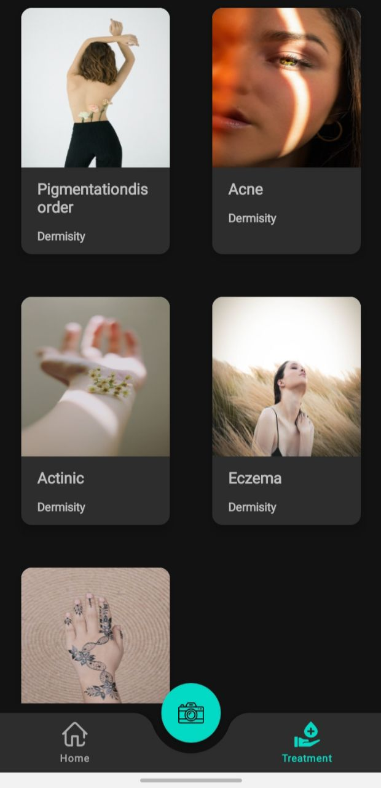
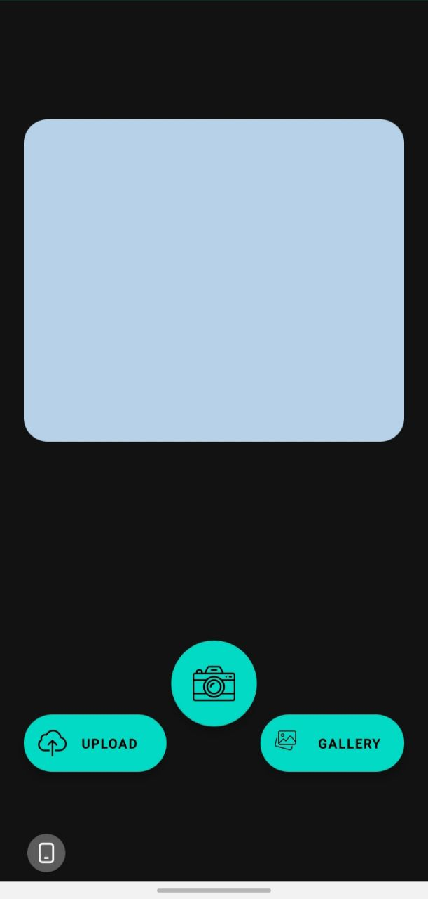

# B21-CAP0314 Bangkit 2021 Capstone Project

## Project Description

Dermisity is an app that will try to identify skin disease from the picture taken from the user's camera, and provide
information such as what is the possible disease they suffer and it also gives the user's recommended treatment for
their skin disease.

## Screenshoots

<div>
  <p align="center">
    
    
    
    
    
  </p>
</div>

## Deployment Steps

Here are the steps for deploying this project:

1. Create Google Cloud Platform Project
2. Create a Compute Engine, Cloud firestore, Cloud Storage (Bucket)
3. Open backend/machinelearning/model_training_notebook.ipynb, change the value of project_id and bucket_name to your
   GCP Project
4. Run the model_training_notebook.ipynb until success saving the model to the Cloud Storage
5. Open your Compute Engine, and clone this git project
6. Install the latest python3, pip and nginx.
7. Create and activate venv
8. Open backend/cloud directory and run

 ```sh
pip install -r requirements.txt"
```

9. Create wsgi.py for connecting between Flask and Nginx with this content:

```sh
from app import app

if __name__ == "__main__":
    app.run()
```

10. Create a systemd Unit File, edit the file:

```sh
sudo nano /etc/systemd/system/app.service
```

change the value of User to yourusername and WorkingDirectory, and Environment to backend/cloud directory

also change the value of ExecStart to your gunicorn directory and change the worker parameter to your CPU count.

then run:

```sh
sudo systemctl start app
sudo systemctl enable app
```

11. Copy the saved model from google cloud storage to backend/cloud directory, with this command:

```sh
gsutil cp gs://model-directory .
```

12. Install nginx, and edit the configuration with this command:

```sh
nano /etc/nginx/sites-available/app
```

and change the content of server like this:

```sh
server {
    listen 80;
    server_name server-ip;

    location / {
        include proxy_params;
        proxy_pass http://unix:/home/user/radiant-bangkit-capstone/backend/cloud/app.sock;
    }
}
```

13. Run this command:

```sh
sudo ln -s /etc/nginx/sites-available/app /etc/nginx/sites-enabled
sudo systemctl restart nginx
sudo ufw allow 'Nginx Full'
```

14. Then the API server can be accessed at: http://server_domain_or_IP

15. For the android app, open ApiConfig.kt, and change the value of BASE_URL variable to your http://server_domain_or_IP

16. open gradle.properties, and change the value of latestinfo_apikey to your News API Key

Done

## Built With Love By B21-CAP0314:

### Android

* [Rd.M.Dimas Burhanudin Akbar A1181504](https://github.com/raden-dimas-012)
* [Habib Abdurrasyid A1191512](https://github.com/rasyidev)

### Cloud

* [Assyifa Almayzarani C0070750](https://github.com/syifalmyzarani)
* [Rasyidana Sulthan F C1181506](https://github.com/rashoelfa)

### Machine Learning

* [Leonard Rizta Anugerah Perdana M1191519](https://github.com/leonardrizta)
* [Kinanti Ayudya Putri Rahardiani M0070717](https://github.com/kaputrir)